[comment]: <> (README file)

# Autonomous Truck Robots

#### _(Ongoing Project)_ 
This is an overview of a Perception-Module software stack developed to research machine perception of autonomous trucks/buses, where different possible system-architectures could be explored and various features could be experimented. 

This perception system has been developed with the help of autonomous scaled-down truck-like robots in a research laboratory. The major use-cases chosen were the automation of Distribution-Centers/Bus-Depots. 

### Features incorporated into the Perception System-Architecture:
* V2I &rarr; Vehicle-to-Infrastructure communication
* V2V &rarr; Vehicle-to-Vehicle communication
* Centralized (or) De-centralized intelligence via
  * Vehicle intelligence
  * Infrastructure intelligence
* De-centralized & efficient data processing
* Message-protocols to minimized dataflow
* Realtime services

 

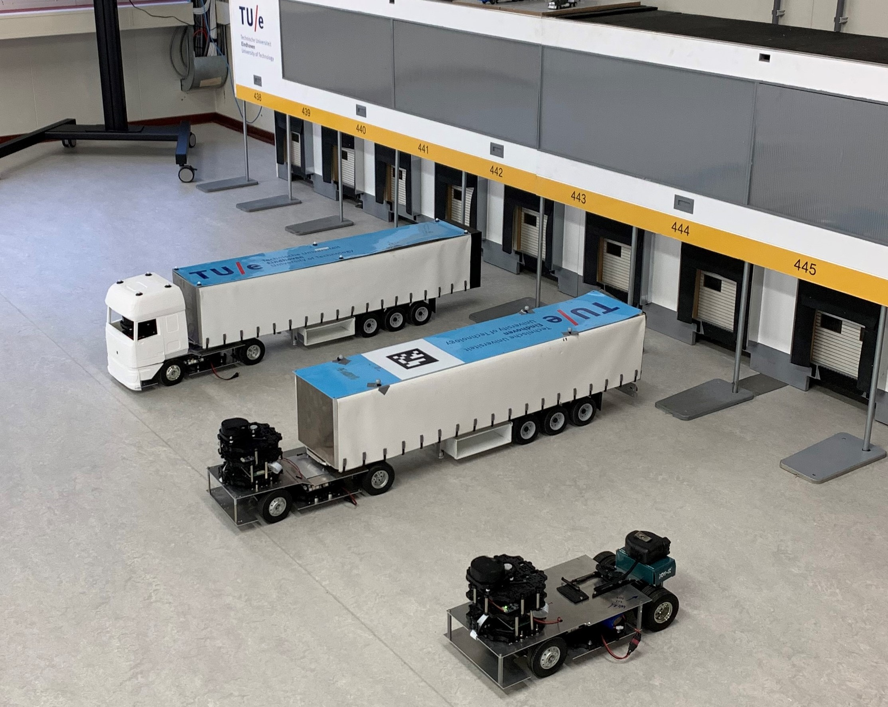

 

***
### Perception features developed:
#### Primary features:
* Realtime Camera & 2D LiDAR plotting
* Realtime Collision Alert
* Realtime Motion Sensing
* Closest Object-distance Retrieval
* Vehicle communication &rarr; Publish ego-location, ego-velocity
* Infrastructure communication &rarr; Sense & publish vehicles locations (using motion-capture system)

#### Advanced features:
* Realtime Multiple 2D Object Detection &rarr; using customized Neural Networks
* Realtime Multiple 2D Object Localization
* Realtime Multiple 2D Object Tracking (in progress)
* Simulation City &rarr; Training Data Generation technique for 2D LiDAR point-clouds
* Sensor fusion of multiple LiDAR point-clouds
***

Please find demonstrations of some features below:

## Realtime Video Capturing:
Realtime communication of video feed from the robot's camera. \
_(Turtlebot3 Waffle Pi, Raspberry Pi camera)_

 

## Realtime 2D Object Prediction:
#### Object detection and ranging of tractors and trailers. 
**Input:** LiDAR point-cloud of interested region \
**Interpreter:** Customized YOLOv3 Neural Network Architecture - to process BEV images \
**Output:** Detected objects and locations within the interested region

_(Sample rate = 0.25 hz)_

## &darr;

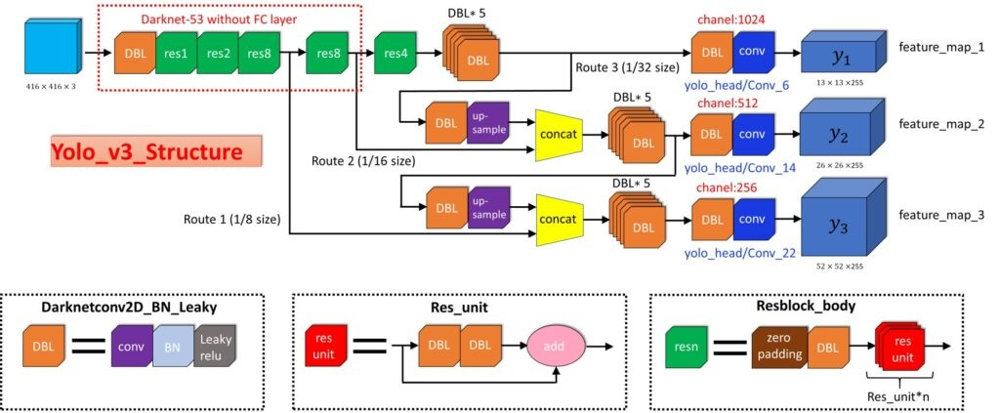

## &darr;

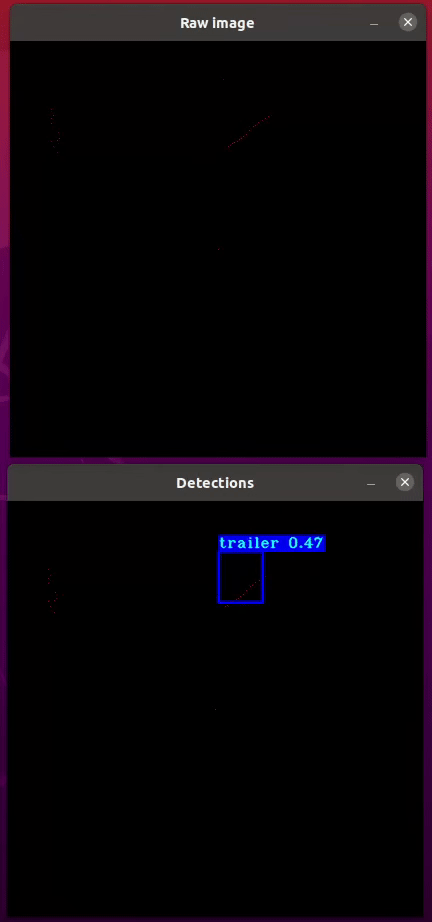

 

## Realtime SLAM:
SLAM technique performed with the latest G-mapping technique using ROS. \
Utilizes realtime lidar scan (/scan) and odometry (/odom) ROS msgs. \
Static map of interested regions obtained. \
Also used to obtain point-cloud shapes of interested objects.

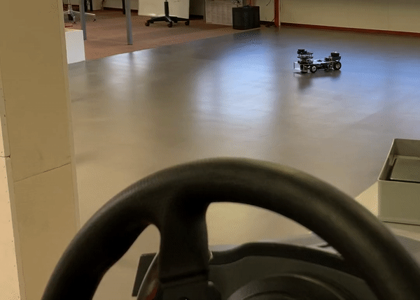

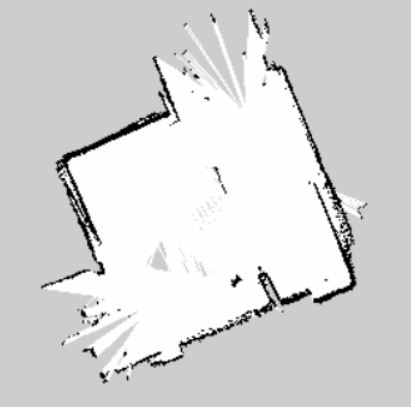

 

## Simulation City &rarr; Custom Training Data Generation
Simulation of custom environment and objects to generate random LiDAR point-cloud data 

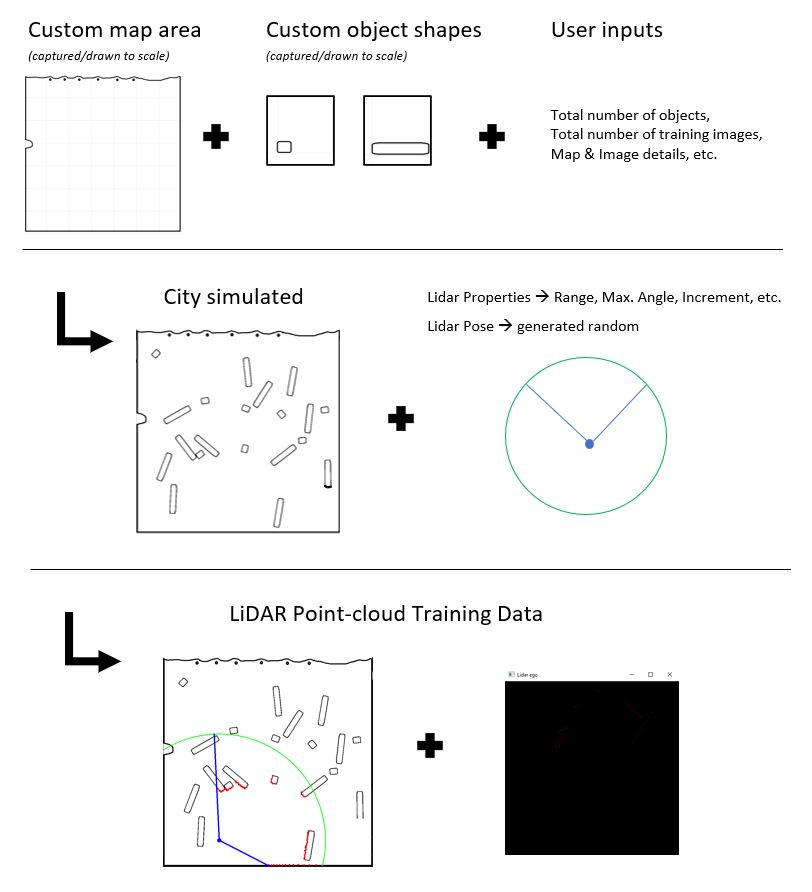

 

## Sensor Fusion of Multiple LiDAR point-clouds
Simulation of complementary LiDAR sensor data fusion.

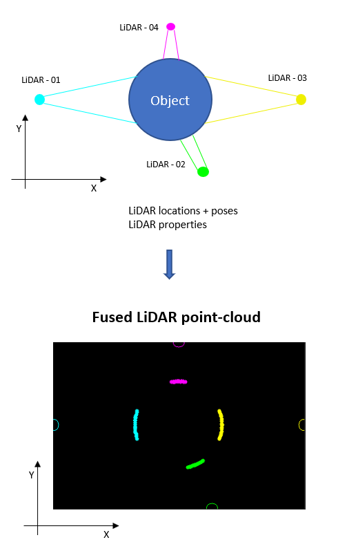

 
 

***
***

## Realtime Collision Alert:

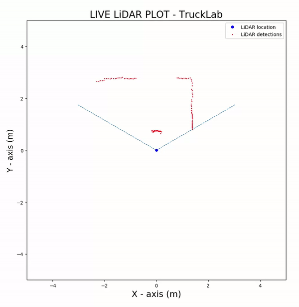

 

## Realtime Motion Sensing:

 

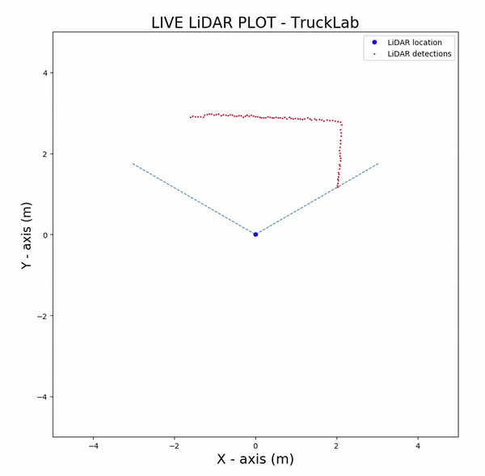

 

## LiDAR Server: Find closest obstacle distance:

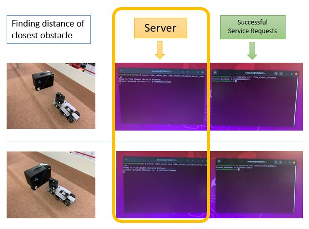

 

## Camera Server: Click a picture using Robot's Camera

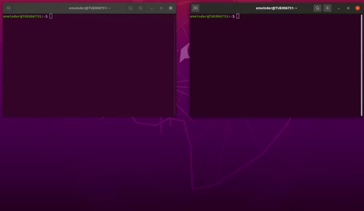

 

